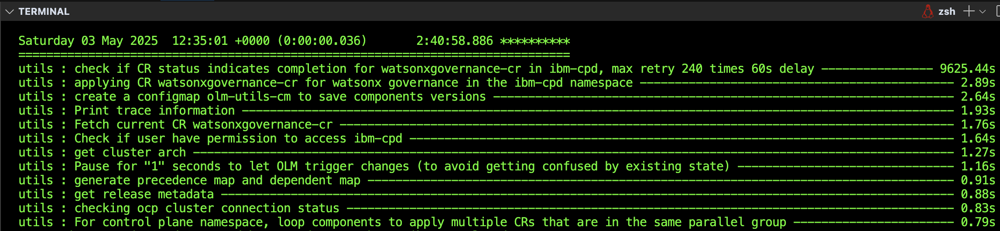
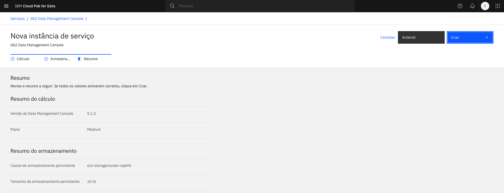
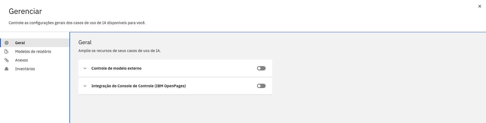

# IBM Cloud Pak for Data v5.2.0 Installation Guide in Red Hat OpenShift Container Platforn v4.18.38

##### This document aims to demonstrate how the installation of ``Cloud Pak for Data`` in the ``OpenShift v4.18`` environment was executed, installation and configuration of instances of ``DB2, DB2 Data Management Console, Watson Machine Learning, Watson Studio, watsonx.governance, AI Factsheets, Watson OpenScale``.

## Services & integrations 

- **DB2**

- **Watson Machine Learning**

- **Watson Studio**

- **watsonx.governance**

- **AI Factsheets**

- **Watson OpenScale**

- **SPSS Modeler**

- **watsonx.data**

- **Cognos Analytics**

- **Planning Analytics**

- **DataStage** 

- **Analytics Engine powered by Apache Spark**

- **watsonx Code Assistant for Z**


## Prerequisites:
 - Have an OpenShift v4.16 cluster or higher.
 - Have an ``Entitlement Key``
 - Binary ``cpd-cli`` for environment variables.

 ## Installing Cloud Pak for Data via Bastion

 The ``Bastion`` machine is widely used for ``Air-Gap`` installations of Cloud Paks, This type of installation is necessary because the environment **does not have direct internet access**. The Bastion machine serves as an intermediate point for downloading necessary images and packages, which are then transferred to the OpenShift cluster.

##### To be able to log in, you need to obtain these credentials from the **TechZone** image of the provisioned OpenShift cluster:

- Bastion SSH connection
- Bastion Password
- Go to the terminal and log in ``SSH`` with the credentials obtained:


 ## OpenShift Cluster Configuration


  Our cluster has 3 **control-planes/master-nodes** that are responsible for orchestrating and managing the cluster.
 
 - Api Server (**kube-apiserver**) -> responsible for processing API requests.
 - Controller Manager (**kube-controller-manager**) -> manages desired states of the objects in the cluster.
 - Scheduler (**kube-scheduler**) –> decides which nodes the Pods will run on.
 - ETCD – stores all the state data of the cluster.
 
**Workers**, in turn, are responsible for running workloads, which is where we install and configure **Cloud Pak for Data Pods, Deployments, and Services**.

**Storages**, on the other hand, are designed to act as storage nodes, because ``OpenShift Data Foundation (ODF)`` needs dedicated nodes to store and manage persistent volumes.

## Installing the IBM Cloud Pak for Data command-line interface **(cpd-cli)**

 To install the IBM Cloud Pak for Data software on your **RedHat® OpenShift® Container Platform** cluster, you must install the Cloud Pak for Data command-line interface ``(cpd-cli)`` on the workstation from which you are running the installation commands.

 #### Download version ``14.0.3`` of cpd-cli from the **IBM/cpd-cli** repository on GitHub. 
 Ensure that you download the correct package based on the Cloud Pak for Data license you purchased and the operating system on the customer's workstation:  
- Download the **Enterprise Edition**:


The Bastion server is a Linux workstation. Download the Linux® Enterprise Edition x86_64 le with
this name: cpd-cli-linux-EE-14.1.0.tgz:

```
wget https://github.com/IBM/cpd-cli/releases/download/v14.1.0/cpd-cli-linux-EE-14.1.0.tgz
```


Extract the package:

```
tar -xzf cpd-cli-linux-EE-14.1.0.tgz
```


- Enter the directory and run unlimited commands to the ``cpd-cli`` file:

```
cd cpd-cli-linux-EE-14.1.0.tgz/
```

```
chmod 777 cpd-cli
```


## Podman Installation and Configuration

```
sudo yum install podman
```

```
sudo sysctl user.max_user_namespaces=15000
```

```
sudo usermod --add-subuids 200000-201000 --add-subgids 200000-201000 $(whoami)
```

```
grep $(whoami) /etc/subuid /etc/subgid
```

```
podman version
```


## Setting environment variables installation environment - (cpd_vars.sh)

The commands for installing various components on the OCP cluster from the Baston use variables with the format ``${VARIABLE_NAME}``. You can create a script to automatically export the appropriate values as environment variables before you run the installation commands. After you source the script, you will be able to copy most installation and upgrade commands from the documentation and run them without making any changes. 

```
wget https://raw.githubusercontent.com/CloudPak-Outcomes/Outcomes-Projects/refs/heads/main/L4assets/Installation/cpd_vars.sh
```


```
#===============================================================================
# IBM Software Hub installation variables
#===============================================================================

# ------------------------------------------------------------------------------
# Client workstation 
# ------------------------------------------------------------------------------
# Set the following variables if you want to override the default behavior of the IBM Software Hub CLI.
#
# To export these variables, you must uncomment each command in this section.

# export CPD_CLI_MANAGE_WORKSPACE=<enter a fully qualified directory>
# export OLM_UTILS_LAUNCH_ARGS=<enter launch arguments>


# ------------------------------------------------------------------------------
# Cluster
# ------------------------------------------------------------------------------

export OCP_URL=<enter your Red Hat OpenShift Container Platform URL>
export OPENSHIFT_TYPE=<enter your deployment type>
export IMAGE_ARCH=<enter your cluster architecture>
# export OCP_USERNAME=<enter your username>
# export OCP_PASSWORD=<enter your password>
# export OCP_TOKEN=<enter your token>
export SERVER_ARGUMENTS="--server=${OCP_URL}"
# export LOGIN_ARGUMENTS="--username=${OCP_USERNAME} --password=${OCP_PASSWORD}"
# export LOGIN_ARGUMENTS="--token=${OCP_TOKEN}"
export CPDM_OC_LOGIN="cpd-cli manage login-to-ocp ${SERVER_ARGUMENTS} ${LOGIN_ARGUMENTS}"
export OC_LOGIN="oc login ${SERVER_ARGUMENTS} ${LOGIN_ARGUMENTS}"


# ------------------------------------------------------------------------------
# Proxy server
# ------------------------------------------------------------------------------

# export PROXY_HOST=<enter your proxy server hostname>
# export PROXY_PORT=<enter your proxy server port number>
# export PROXY_USER=<enter your proxy server username>
# export PROXY_PASSWORD=<enter your proxy server password>
# export NO_PROXY_LIST=<a comma-separated list of domain names>


# ------------------------------------------------------------------------------
# Projects
# ------------------------------------------------------------------------------

export PROJECT_CERT_MANAGER=<enter your certificate manager project>
export PROJECT_LICENSE_SERVICE=<enter your License Service project>
export PROJECT_SCHEDULING_SERVICE=<enter your scheduling service project>
# export PROJECT_IBM_EVENTS=<enter your IBM Events Operator project>
# export PROJECT_PRIVILEGED_MONITORING_SERVICE=<enter your privileged monitoring service project>
export PROJECT_CPD_INST_OPERATORS=<enter your IBM Software Hub operator project>
export PROJECT_CPD_INST_OPERANDS=<enter your IBM Software Hub operand project>
# export PROJECT_CPD_INSTANCE_TETHERED=<enter your tethered project>
# export PROJECT_CPD_INSTANCE_TETHERED_LIST=<a comma-separated list of tethered projects>


# ------------------------------------------------------------------------------
# Storage
# ------------------------------------------------------------------------------

export STG_CLASS_BLOCK=<RWO-storage-class-name>
export STG_CLASS_FILE=<RWX-storage-class-name>

# ------------------------------------------------------------------------------
# IBM Entitled Registry
# ------------------------------------------------------------------------------

export IBM_ENTITLEMENT_KEY=<enter your IBM entitlement API key>


# ------------------------------------------------------------------------------
# Private container registry
# ------------------------------------------------------------------------------
# Set the following variables if you mirror images to a private container registry.
#
# To export these variables, you must uncomment each command in this section.

# export PRIVATE_REGISTRY_LOCATION=<enter the location of your private container registry>
# export PRIVATE_REGISTRY_PUSH_USER=<enter the username of a user that can push to the registry>
# export PRIVATE_REGISTRY_PUSH_PASSWORD=<enter the password of the user that can push to the registry>
# export PRIVATE_REGISTRY_PULL_USER=<enter the username of a user that can pull from the registry>
# export PRIVATE_REGISTRY_PULL_PASSWORD=<enter the password of the user that can pull from the registry>


# ------------------------------------------------------------------------------
# IBM Software Hub version
# ------------------------------------------------------------------------------

export VERSION=5.1.3


# ------------------------------------------------------------------------------
# Components
# ------------------------------------------------------------------------------

export COMPONENTS=ibm-licensing,scheduler,cpfs,cpd_platform
# export COMPONENTS_TO_SKIP=<component-ID-1>,<component-ID-2>


# ------------------------------------------------------------------------------
# watsonx Orchestrate
# ------------------------------------------------------------------------------
# export PROJECT_IBM_APP_CONNECT=<enter your IBM App Connect in containers project>
# export AC_CASE_VERSION=<version>
# export AC_CHANNEL_VERSION=<version>
```
### Setting up environment variables for ``cpd_vars.sh`` file

The commands for installing and upgrading ``IBM® Software Hub`` use variables with the format ``${VARIABLE_NAME}``. You can create a script to automatically export the appropriate values
as environment variables before you run the installation commands. After you source the script, you will be able to copy most install 
and upgrade commands from the documentation and run them without making any changes.

## Cluster variables

The variables in the Cluster section of the script specify information about your Red Hat OpenShift Container Platform cluster.

| Variables | Description |
| --------- | ----------- |
| OCP_URL   | The URL of the Red Hat OpenShift Container Platform server. For example, https://openshift1.example.com:8443 |
| OPENSHIFT_TYPE | **Default value**: ``self-managed`` **Valid values**: ``aro`` for OCP on Azure, ``roks`` for OCP on IBM Cloud & ``rosa`` for OCP on AWS|
| IMAGE_ARCH | **Valid values**: ``amd64`` for x86_64 hardware. ``ppc64le`` for Power hardware. ``s390x`` for Z hardware. |
| OCP_USERNAME | The username that you use to authenticate to your cluster. You must have sufficient privileges to complete each installation or upgrade task. To use the ``OCP_USERNAME`` variable, you must uncomment the export command in the environment variables file. |
| OCP_PASSWORD | The password that you use to authenticate to your cluster. To use the ``OCP_PASSWORD`` variable, you must uncomment the export command in the environment variables file. |
| SERVER_ARGUMENTS | The *SERVER_ARGUMENTS* environment variable depends on the ``OCP_URL`` environment variable. |
| LOGIN_ARGUMENTS | If you specify a username and password, the *LOGIN_ARGUMENTS* environment variable depends on the following environment variables: ``${OCP_USERNAME}`` ``${OCP_PASSWORD}``. |
| CPDM_OC_LOGIN | The *CPDM_OC_LOGIN* environment variable depends on the following environment variables: ``${SERVER_ARGUMENTS}`` ``${LOGIN_ARGUMENTS}``. |
| OC_LOGIN | The *OC_LOGIN* environment variable depends on the following environment variables: ``${SERVER_ARGUMENTS}`` ``${LOGIN_ARGUMENTS}``.|

## Project variables

The variables in the Projects section of the script specify where the components that comprise IBM Software Hub are installed.

| Variables | Description |
| --------- | ----------- |
| PROJECT_CERT_MANAGER | **Default value**: ``ibm-cert-manager`` - The project for the IBM Certificate manager operator. |
| PROJECT_LICENSE_SERVICE | **Default value**: ``ibm-licensing`` - The project for the Licensing Service operator. |
| PROJECT_SCHEDULING_SERVICE | **Valid value**: ``ibm-cpd-scheduler`` - The project for the scheduling service. |
| PROJECT_PRIVILEGED_MONITORING_SERVICE | **Valid value**: ``use ibm-cpd-privileged`` - The OpenShift project for the IBM Software Hub privileged monitoring service. The privileged monitoring service is optional, but provides additional monitoring and logging information for IBM Software Hub. |
| PROJECT_CPD_INST_OPERATORS | **Valid value**: ``ibm-operators`` - The project where you want to install the operators for this instance of IBM Software Hub. |
| PROJECT_CPD_INST_OPERANDS | **Valid value**: ``ibm-cpd`` - The project for the IBM Software Hub control plane and services. |

## Storage variables

The variables in the Storage section of the script specify the storage classes that the installation should use.

| Vaiables | Description |
| -------- | ----------- |
| STG_CLASS_BLOCK | **Valid values**: ``ocs-storagecluster-ceph-rbd`` for *OpenShift Data Foundation*, ``ocs-storagecluster-ceph-rbd`` for *IBM Fusion Data Foundation*, ``ibm-spectrum-scale-sc`` & ``ibm-storage-fusion-cp-sc`` for *IBM Fusion Global Data Platform*, ``managed-nfs-storage`` for *NFS* and ``gp2-csi`` & ``gp3-csi`` for *Amazon Elastic Block Store* |
| STG_CLASS_FILE | **Valid values**: ``ocs-storagecluster-cephfs`` for *OpenShift Data Foundation*, ``ocs-storagecluster-cephfs`` for *IBM Fusion Data Foundation*, ``ibm-spectrum-scale-sc`` & ``ibm-storage-fusion-cp-sc`` for *IBM Fusion Global Data Platform*, ``managed-nfs-storage``, for *NFS* and ``efs-nfs-client`` for *Amazon Elastic Block Store* |

## IBM Entitled Registry

The variables in the ``IBM Entitled Registry`` section of the script enable you to connect to the IBM Entitled Registry and access the ``IBM Software Hub`` software images that you are entitled to. Depending on whether you pull images from the IBM Entitled Registry or from a private container registry, the variables might also be used to configure the global image pull secret.

| Vaiables | Description |
| -------- | ----------- |
| IBM_ENTITLEMENT_KEY | your *IBM_ENTITLEMENT_KEY* - The entitlement API key that is associated with your My IBM account. |

## IBM Software Hub version

The variable in the ``IBM Software Hub`` version section specifies which version of IBM Software Hub to install or upgrade to.

| Vaiables | Description |
| -------- | ----------- |
| VERSION | **Valid values**: ``5.1.0``, ``5.1.1``, ``5.1.2`` and ``5.1.3`` - The version of the IBM Software Hub software to install.|

## Components variables

The variables in the *Components* section help you manage the software that is associated with an instance of ``IBM Software Hub``. For example, you can use the COMPONENTS environment variable to ensure that you specify the same components when you:

- Mirror images to a private container registry

- Create the operators for an instance of IBM Software Hub

- Install the software for an instance of IBM Software Hub

| Vaiables | Description |
| -------- | ----------- |
| COMPONENTS | **Default values**: ``ibm-licensing``, ``scheduler``, ``cpfs`` and ``cpd_platform`` - A comma separated list of the components that you want to install or upgrade.|


The *Software Hub* control plane and services are installed by using operators, which simplify the process of upgrading and scaling software on *Red Hat OpenShift*. An operator is a custom *Kubernetes* controller that is responsible for managing a component. *Software Hub* uses the ``Operator Lifecycle Manager (OLM)`` to install, update, and manage operators.

An operator subscription provides the following information to the OLM:

- The name of the operator

- The location to install the operator

- The channel to subscribe to

- The install plan approval mechanism to use

- The catalog source to use

- Confirm that the script does not contain any errors. For example, if you named the script ``cpd_vars.sh``, run:

```
bash ./cpd_vars.sh
```

- Provide the environment variables. For example, if you named the script ``cpd_vars.sh``, run:

```
chmod 777 cpd_vars.sh
```

```
source ./cpd_vars.sh
```


### Adding the command interface to the ``$PATH``

```
echo 'export PATH=/home/itzuser/cpd-cli-linux-EE-14.1.0-1189:$PATH' >> ~/.bash_profile
```

```
echo 'source /home/itzuser/cpd-cli-linux-EE-14.1.0-1189/cpd_vars.sh' >> ~/.bash_profile
```

```
source ~/.bash_profile
```

## Installing cert-manager

Select Operators from the Red Hat OpenShift console and then OperatorHub:


search by cert-manager and choose `cert-manager Operator for Red Hat OpenShift`


Click the blue ``Install`` button:


Select the option *A specific namespace in the cluster* then click *Install*


- Verify that the ``Red Hat Operator Lifecycle Manager (OLM)`` is created with this command:

```
oc get subscription -n cert-manager-operator
```

- Verify that the Operator has been successfully installed with this command:

```
oc get csv -n cert-manager-operator
```

- Verify that the cert-manager pods are running with the command:

```
oc get pods -n cert-manager
```


## Installing Red Hat OpenShift AI

```
${CPDM_OC_LOGIN}
```

- Create the ``redhat-ods-operator`` project with the command:
```
oc new-project redhat-ods-operator
```


- Create the ``rhods-operator`` operator group in the ``redhad-ods-operator`` project. To do so, create a file ``redhat-ods-operator.yml`` file with this content:

```
apiVersion: operators.coreos.com/v1
kind: OperatorGroup
metadata:
  name: rhods-operator
  namespace: redhat-ods-operator
```

Run this command:

```
oc apply -f redhat-ods-operator.yml
```


- Create the ``rhods-operator`` operator subscription in the ``redhat-ods-operator`` project. To do so, create a file ``redhat-ods-operator-subs.yml`` file with this content:

```
apiVersion: operators.coreos.com/v1alpha1
kind: Subscription
metadata:
  name: rhods-operator
  namespace: redhat-ods-operator
spec:
  name: rhods-operator
  channel: stable-2.13
  source: redhat-operators
  sourceNamespace: openshift-marketplace
  config:
    env:
      - name: "DISABLE_DSC_CONFIG"
```

Run this command:

```
oc apply -f redhat-ods-operator-subs.yml
```


- You will now need to create a ``Red Hat OpenShift Data Science Cluster (DSC)`` object that is called ``default-dsci`` in the ``redhat-ods-monitoring`` project. This is a feature of ``Red Hat OCP`` that allows users to work with certificates. To do so, create a file ``default-dsci.yml`` file with this content:

```
apiVersion: dscinitialization.opendatahub.io/v1
kind: DSCInitialization
metadata:
  name: default-dsci
spec:
  applicationsNamespace: redhat-ods-applications
  monitoring:
    managementState: Managed
    namespace: redhat-ods-monitoring
  serviceMesh:
    managementState: Removed
  trustedCABundle:
    managementState: Managed
    customCABundle: ""
```

Run this command:

```
oc apply -f default-dsci.yml
```


1 - Confirm that the ``rhods-operator-*`` pod in the ``redhat-ods-opearator`` project are running with the command:

```
oc get pods -n redhat-ods-operator
```

2 - Check the phase of the ``DSC Initialization (DSCInitialization)`` object with the command:

```
oc get dscinitialization
```


- For ``watsonx.ai``, you will also need to create a ``Data Science Cluster (DataScienceCluster)`` object called ``default-dsc``. To do so, create a file ``*default-dsc-cluster.yml*`` file with this content:

```
apiVersion: datasciencecluster.opendatahub.io/v1
kind: DataScienceCluster
metadata:
  name: default-dsc
spec:
  components:
    codeflare:
      managementState: Removed
    dashboard:
      managementState: Removed
    datasciencepipelines:
      managementState: Removed
    kserve:
      managementState: Managed
      defaultDeploymentMode: RawDeployment
      serving:
        managementState: Removed
        name: knative-serving
    kueue:
      managementState: Removed
    modelmeshserving:
      managementState: Removed
    ray:
      managementState: Removed
    trainingoperator:
      managementState: Managed
    trustyai:
      managementState: Removed
    workbenches:
      managementState: Removed
```

Run the command:

```
oc apply -f default-dsc-cluster.yml
```


3 - Check to ensure that the ``Dace Science Cluster`` object is ready with this command:

```
oc get datasciencecluster default-dsc -o jsonpath='"{.status.phase}" {"\n"}'
```


Next check the status of the ``redhat-ods-applications`` pods. In particular, you are looking for the following three pods and each should be running.

- kserve-controller-manager-* pod

- kubeflow-training-operator-* pod

- odh-model-controller-* pod

Run this command:

```
oc get pods -n redhat-ods-applications
```


The last setup step for setting up ``Red Hat OpenShift AI`` involves editing the ``inferenceservice-config`` file in the ``redhat-ods-applications`` project. You need to do this on the ``Red Hat OpenShift Console``.

- Click Workloads, then click ConfigMaps:


- The ConfigMaps page opens; Click Project: All Projects, then click ``redhat-ods-applications`` from the pulldown:


- The Project: ``redhat-ods-applications`` page opens. Click ``inferenceservice-config``:


- The ``inferenceservice-config`` page opens. Click the ``YAML`` tab.


- The YAML file opens. At the top is the metadata section. add the following file:

```
opendatahub.io/managed: 'false'
```


- At ``INGRESS CONFIGURATION`` Look for this line ``"domainTemplate": "{{ .Name }}-{{ .Namespace }}.{{ .IngressDomain }}"``, delete it and add the following line:

```
"domainTemplate": "example.com",
```
- Then, click ``Save``

Before:

After:


## Preparing to install

IBM Software Hub supports numerous solutions and services. Before you install IBM Software Hub, determine which components you need to install to support your business requirements. With the ``IBM Software Hub``, you drive your installation with configuration files. Once you have determined what you need to install, you update the sample file (see below) and use the ``cpd-cli`` to perform the installation.

### Cluster-wide components

These components can be installed exactly once on the cluster and are shared by all instances of ``IBM Software Hub`` on the cluster.

``License Service:``      required to keep a record of the size of deployments >> ibm-licensing 
``Scheduling service:``  for deep learning in Watson Machine Learning          >> scheduler 

### Software Hub

These components are installed each time that you install an instance of ``IBM Software Hub``.

``Cloud Pak foundational services:`` >> cpfs
``Cloud Pak for Data:``              >> cpd_platform

### Services

``Synthetic Data Generator``  >>  syntheticdata
``watsonx.ai``                >>  watsonx_ai
``watsonx Assistant``         >>  watson_assistant
``watsonx Code Assistant``    >>  watson_assistant
``Data Product Hub``          >>  dataproduct

## Prepare the cluster for IBM Software Hub

To deploy various services, you need to set up ``IBM Software Hub`` on your cluster. This section covers a number of tasks that you need to perform to prepare your cluster for ``IBM Software Hub`` installation.

### Update the global image pull secret

The global image pull secret ensures that your cluster has the necessary credentials to pull images. You’re using the ``IBM Entitled Registry``.

- Log in to cpd-cli with this command:

```
${CPDM_OC_LOGIN}
```


- Provide your ``IBM Entitlement API Key`` to the global image pull secret with this command:

```
cpd-cli manage add-icr-cred-to-global-pull-secret \
--entitled_registry_key=${IBM_ENTITLEMENT_KEY}
```


- Reload the worker nodes with this command to ensure all are ready:

```
cpd-cli manage oc get nodes
```


### Manually create projects (namespaces) for the shared cluster components

There are several projects (namespaces in OCP) required to deploy various services. The output of each of the following commands is similar.

- Create the project for the ``License Service`` Run:

```
oc new-project ${PROJECT_LICENSE_SERVICE}
```


- Create the project for the scheduling service. Run:

```
oc new-project ${PROJECT_SCHEDULING_SERVICE}
```


- Create the operator project. Run:

```
oc new-project ${PROJECT_CPD_INST_OPERATORS}
```


Create the operands project. Run:

```
oc new-project ${PROJECT_CPD_INST_OPERANDS}
```


### Install shared cluster components

Before you install ``IBM Software Hub``, you must install the ``IBM Cloud Pak`` foundational services ``License Service`` and the IBM Software Hub scheduling service. After you enter each ``cpd-cli`` command, wait for the SUCCESS message before entering the next command. These commands include built-in pauses and will take time to complete.

Install the License Service. Run:

```
cpd-cli manage apply-cluster-components --release=${VERSION} \
--license_acceptance=true --licensing_ns=${PROJECT_LICENSE_SERVICE}
```


- Install the scheduling service. Run:

```
cpd-cli manage apply-scheduler --release=${VERSION} \
--license_acceptance=true --scheduler_ns=${PROJECT_SCHEDULING_SERVICE}
```


## Change required node settings

To ensure that the cluster has the required settings for these services, adjust the settings on the appropriate nodes in the cluster.

### Change the process IDs limit

To ensure that these services run correctly, increase the process ID limit setting on the ``OpenShift® Container Platform``.

- Create the kubeletconfig that defines the ``podPidsLimit``. To do so, create a file ``pod-limit.yml`` file with this content:

```
apiVersion: machineconfiguration.openshift.io/v1
kind: KubeletConfig
metadata:
  name: cpd-kubeletconfig
spec:
  kubeletConfig:
    podPidsLimit: 16384
  machineConfigPoolSelector:
    matchExpressions:
      - key: pools.operator.machineconfiguration.openshift.io/worker
        operator: Exists
```

Run this command:

```
oc apply -f pod-limit.yml
```


## Prepare to install an instance of IBM Software Hub

Before you can install ``IBM Software Hub``, you must check the health of your cluster.

### Validate the health of your cluster before you install IBM Software Hub.

Run the cluster commands below:

```
cpd-cli health cluster
```
```
cpd-cli health nodes
```
```
cpd-cli health network-performance
```

## Apply the required permissions

Ensure that the project where the operators will be installed can watch the project where the control plane and services are installed.

- Run this command:

```
cpd-cli manage authorize-instance-topology \
--cpd_operator_ns=${PROJECT_CPD_INST_OPERATORS} \
--cpd_instance_ns=${PROJECT_CPD_INST_OPERANDS}
```


## Install IBM Software Hub

To install an instance of ``IBM Software Hub``, you must install the required operators and custom resources for the instance. Note: Do not set ``run_storage_tests`` to true in a non-production environment, as it is likely to fail.

```
cpd-cli manage setup-instance \
--release=${VERSION} \
--license_acceptance=true \
--cpd_operator_ns=${PROJECT_CPD_INST_OPERATORS} \
--cpd_instance_ns=${PROJECT_CPD_INST_OPERANDS} \
--block_storage_class=${STG_CLASS_BLOCK} \
--file_storage_class=${STG_CLASS_FILE} \
--run_storage_tests=false
```


In version 5.1, installing the ``IBM Software Hub`` includes the following:

    - Setting up instance topology

    - Creating operator subscriptions (apply-olm) for Cloud Pak Foundation Service (cpfs) and Cloud Pak for Data Platform (cpd_platform).

    - Installing the cpfs and cpd_platform.

- Confirm the status of the operands. Run the following command:

```
cpd-cli manage get-cr-status \
--cpd_instance_ns=${PROJECT_CPD_INST_OPERANDS}
```


- Get the ``URL`` and default credentials of the ``IBM Software Hub`` web client with this command:

```
cpd-cli manage get-cpd-instance-details \
--cpd_instance_ns=${PROJECT_CPD_INST_OPERANDS} \
--get_admin_initial_credentials=true
```


## Log in IBM Software Hub

- You can use this information to log in to the IBM Software Hub console using the:

**CPD URL:**
**CPD Username:**
**CPD Password:**


## Set up IBM Software Hub

After you install IBM Software Hub, complete these setup tasks.

### Install privileged monitors

Privileged monitors provide additional information about the health of the cluster and resources that are not typically included in the platform monitors. If you want to add privileged monitors to an instance of ``IBM Software Hub``, a cluster administrator must install the privileged monitoring service. Follow the instructions in the documentation.

### Apply entitlements

Even though you are working in a non-production environment, you must provide information about the licenses that you are using. If you skip this step, you are unable to install any solutions or services.

- Run the *apply-entitlement* command for the platform: ``Cloud Pak for Data Enterprise Edition``. Run the following command:

```
cpd-cli manage apply-entitlement \
--cpd_instance_ns=${PROJECT_CPD_INST_OPERANDS} \
--entitlement=cpd-enterprise \
--production=false
```


## status Custom Resources

```
cpd-cli manage get-cr-status \
  --cpd_instance_ns=${PROJECT_CPD_INST_OPERANDS} \
  --filter=cr_kind,cr_name,progress,cr_status
```


## Installing DB2

```
cpd-cli manage apply-olm \
  --release=${VERSION} \
  --cpd_operator_ns=${PROJECT_CPD_INST_OPERATORS} \
  --components=ibm-cert-manager,db2oltp
```


```
cpd-cli manage apply-cr \
 --release=${VERSION} \
 --cpd_instance_ns=${PROJECT_CPD_INST_OPERANDS} \
 --components=ibm-cert-manager,db2oltp \
 --block_storage_class=${STG_CLASS_BLOCK} \
 --license_acceptance=true
```


- see the status:

```
cpd-cli manage get-cr-status \
  --cpd_instance_ns=${PROJECT_CPD_INST_OPERANDS} \
  --filter=cr_kind,cr_name,progress,cr_status
```


## Installing Watson Machine Learning

```
cpd-cli manage apply-olm \
--release=${VERSION} \
--cpd_operator_ns=${PROJECT_CPD_INST_OPERATORS} \
--components=wml
```


```
cpd-cli manage apply-cr \
--components=wml \
--release=${VERSION} \
--cpd_instance_ns=${PROJECT_CPD_INST_OPERANDS} \
--block_storage_class=${STG_CLASS_BLOCK} \
--file_storage_class=${STG_CLASS_FILE} \
--license_acceptance=true
```

```
cpd-cli manage get-cr-status \
  --cpd_instance_ns=${PROJECT_CPD_INST_OPERANDS} \
  --filter=cr_kind,cr_name,progress,cr_status
```


## Installing DB2 Data Management Console

```
cpd-cli manage apply-olm \
--release=${VERSION} \
--cpd_operator_ns=${PROJECT_CPD_INST_OPERATORS} \
--components=dmc
```

```
cpd-cli manage apply-cr \
--components=dmc \
--release=${VERSION} \
--cpd_instance_ns=${PROJECT_CPD_INST_OPERANDS} \
--license_acceptance=true
```

```
cpd-cli manage get-cr-status \
  --cpd_instance_ns=${PROJECT_CPD_INST_OPERANDS} \
  --filter=cr_kind,cr_name,progress,cr_status
```


## Installing Watson Studio

```
cpd-cli manage apply-olm \
--release=${VERSION} \
--cpd_operator_ns=${PROJECT_CPD_INST_OPERATORS} \
--components=ws
```


```
cpd-cli manage apply-cr \
--components=ws \
--release=${VERSION} \
--cpd_instance_ns=${PROJECT_CPD_INST_OPERANDS} \
--block_storage_class=${STG_CLASS_BLOCK} \
--file_storage_class=${STG_CLASS_FILE} \
--license_acceptance=true
```


```
cpd-cli manage get-cr-status \
  --cpd_instance_ns=${PROJECT_CPD_INST_OPERANDS} \
  --filter=cr_kind,cr_name,progress,cr_status
```


## Elevate DB2 privileges

Now we need to give DB2 provileges, copy the variables below:

```
#!/usr/bin/env bash
###############################################################################
# db2pri.sh – Elevate Db2 privileges (DB2U_RUN_WITH_LIMITED_PRIVS=false)
#
#   1. source ./cpd_vars.sh
#   2. cpd-cli
#   3. ${OC_LOGIN}
#   4. ${CPDM_OC_LOGIN}
###############################################################################

export PATH=/home/itzuser/cpd-cli-linux-EE-14.1.0-1189/:$PATH && \
  source ./cpd_vars.sh && \
  ${OC_LOGIN} && \
  ${CPDM_OC_LOGIN}

echo "*******************************************************************"

LIGHTP='\033[1;35m'
NC='\033[0m'

oc apply -f - <<EOF
apiVersion: v1
kind: ConfigMap
metadata:
  name: db2u-product-cm
  namespace: ${PROJECT_CPD_INST_OPERATORS}
data:
  DB2U_RUN_WITH_LIMITED_PRIVS: "false"
EOF

echo "*******************************************************************"
echo -e "Success message: ${LIGHTP}configmap/db2u-product-cm created${NC}"
```


```
chmod 755 db2pri.sh
```

```
./db2pri.sh
```


## Services Catalog

From IBM Software Hub access: **Services -> Catalog services**


## Installing watsonx.governance

```
cpd-cli manage apply-olm \
--release=${VERSION} \
--cpd_operator_ns=${PROJECT_CPD_INST_OPERATORS} \
--components=watsonx_governance
```


```
cpd-cli manage apply-cr \
--components=watsonx_governance \
--release=${VERSION} \
--cpd_instance_ns=${PROJECT_CPD_INST_OPERANDS} \
--block_storage_class=${STG_CLASS_BLOCK} \
--file_storage_class=${STG_CLASS_FILE} \
--license_acceptance=true
```



## Installing AI Factsheets

```
cpd-cli manage apply-olm \
--release=${VERSION} \
--cpd_operator_ns=${PROJECT_CPD_INST_OPERATORS} \
--components=factsheet
```


```
cpd-cli manage apply-cr \
--components=factsheet \
--release=${VERSION} \
--cpd_instance_ns=${PROJECT_CPD_INST_OPERANDS} \
--block_storage_class=${STG_CLASS_BLOCK} \
--file_storage_class=${STG_CLASS_FILE} \
--license_acceptance=true
```


## Installing Watson OpenScale

```
cpd-cli manage apply-olm \
--release=${VERSION} \
--cpd_operator_ns=${PROJECT_CPD_INST_OPERATORS} \
--components=openscale
```


```
cpd-cli manage apply-cr \
--components=openscale \
--release=${VERSION} \
--cpd_instance_ns=${PROJECT_CPD_INST_OPERANDS} \
--block_storage_class=${STG_CLASS_BLOCK} \
--file_storage_class=${STG_CLASS_FILE} \
--license_acceptance=true
```


```
cpd-cli manage get-cr-status \
  --cpd_instance_ns=${PROJECT_CPD_INST_OPERANDS} \
  --filter=cr_kind,cr_name,progress,cr_status
```


## Update entitlements and branding

```
cpd-cli manage apply-entitlement \
--cpd_instance_ns=${PROJECT_CPD_INST_OPERANDS} \
--entitlement=watsonx-gov-mm \
--production=true \
--apply_branding=true
```


## DB2 Data Management Console 

### Install monitors

### Create an instance for DB2 DMC

```
export MONITORS=cp4d-dmc-info
```

```
cpd-cli manage apply-service-monitor \
--cpd_instance_ns=${PROJECT_CPD_INST_OPERANDS} \
--monitors=${MONITORS}
```


- From **IBM Software Hub** access **IBM watsonx**:


- From **IBM watsonx** go to ``Services -> Services catalog``:


- Search by ``DB2 Data Management Console``:


- Click blue button ``Provision Instance``:


- Let de default (medium) then click ``Next``:


- Storage you must select the ``ocs-storagecluster-cephs``, the same what we define in ``cpd_vars.sh`` file.

- Click ``Next``:


- Review the new instance then click ``Create``:



- Wait until ``data-management-console`` to appear:


## DB2

### Grant additional privileges for DB2
### Create active instance for DB2

```
oc adm policy add-cluster-role-to-user system:controller:persistent-volume-binder system:serviceaccount:${PROJECT_CPD_INSTANCE}:zen-databases-sa
```


- From **IBM watsonx** access ``Services -> Services catalog``:


- Search by ``DB2``:


- Click blue button ``Provision Instance``:


- At ``Storage structure`` choose ``Single location for all data``, let all other default

- Click ``Next``:


- at **Crdentials** select ``Generate a Kubernetes secret``:

- Then click ``Next``:


- In **Storage** select ``ocs-storagecluster-cephs`` then click ``Next``:


- Click ``Create``:


- Wait 5 - 10 minutes util DB2 be create:


## Governance console integration

### Create inventory
### Setup Governance console integration

- From **IBM watsonx** go to ``AI Governance -> AI use cases``:


- Click ``Manage settings``:


- Go to ``Inventories`` and go to ``New Inventory``:


- Create a new inventory without collaborator:


- After create your first inventory, go to ``General`` and active the ``Governance Console (IBM OpenPages) integration``, keep variables default the click ``Apply``:




## External model governance

### Setup External model governance

- Active ``External model governance``, select the inventory that you create early the click ``Apply``:


## watsonx.governance Governance Console

### Access from Services screen

- Go to ``Services -> Instances``:


- Click ``openpagesinstance-cr``then launch OpenPages from ``Access information``:


IBM watsonx | Governance console:


## Installing SPSS Modeler

```
cpd-cli manage apply-olm \
--release=${VERSION} \
--cpd_operator_ns=${PROJECT_CPD_INST_OPERATORS} \
--components=spss
```


```
cpd-cli manage apply-cr \
--components=spss \
--release=${VERSION} \
--cpd_instance_ns=${PROJECT_CPD_INST_OPERANDS} \
--license_acceptance=true
```


```
cpd-cli manage get-cr-status \
  --cpd_instance_ns=${PROJECT_CPD_INST_OPERANDS} \
  --filter=cr_kind,cr_name,progress,cr_status
```

### Creating SPSS instance:


## Installing watsonx.data

```
cpd-cli manage apply-olm \
--release=${VERSION} \
--cpd_operator_ns=${PROJECT_CPD_INST_OPERATORS} \
--components=watsonx_data
```


```
cpd-cli manage apply-cr \
--components=watsonx_data \
--release=${VERSION} \
--cpd_instance_ns=${PROJECT_CPD_INST_OPERANDS} \
--block_storage_class=${STG_CLASS_BLOCK} \
--file_storage_class=${STG_CLASS_FILE} \
--license_acceptance=true
```


## Installing Cognos analytics

```
cpd-cli manage apply-olm \
--release=${VERSION} \
--cpd_operator_ns=${PROJECT_CPD_INST_OPERATORS} \
--components=cognos_analytics
```


```
cpd-cli manage apply-cr \
--components=cognos_analytics \
--release=${VERSION} \
--cpd_instance_ns=${PROJECT_CPD_INST_OPERANDS} \
--block_storage_class=${STG_CLASS_BLOCK} \
--file_storage_class=${STG_CLASS_FILE} \
--license_acceptance=true
```


```
cpd-cli manage get-cr-status \
  --cpd_instance_ns=${PROJECT_CPD_INST_OPERANDS} \
  --filter=cr_kind,cr_name,progress,cr_status
```

## Installing Cognos dashboard

```
cpd-cli manage apply-olm \
--release=${VERSION} \
--cpd_operator_ns=${PROJECT_CPD_INST_OPERATORS} \
--components=dashboard
```


```
cpd-cli manage apply-cr \
--components=dashboard \
--release=${VERSION} \
--cpd_instance_ns=${PROJECT_CPD_INST_OPERANDS} \
--block_storage_class=${STG_CLASS_BLOCK} \
--file_storage_class=${STG_CLASS_FILE} \
--license_acceptance=true
```


```
cpd-cli manage get-cr-status \
  --cpd_instance_ns=${PROJECT_CPD_INST_OPERANDS} \
  --filter=cr_kind,cr_name,progress,cr_status
```

## Installing Planning Analytics

```
cpd-cli manage apply-olm \
--release=${VERSION} \
--cpd_operator_ns=${PROJECT_CPD_INST_OPERATORS} \
--components=planning_analytics
```


```
cpd-cli manage apply-cr \
--components=planning_analytics \
--release=${VERSION} \
--cpd_instance_ns=${PROJECT_CPD_INST_OPERANDS} \
--license_acceptance=true
```


```
cpd-cli manage get-cr-status \
  --cpd_instance_ns=${PROJECT_CPD_INST_OPERANDS} \
  --filter=cr_kind,cr_name,progress,cr_status
```

## Installing DataStage

```
export DATASTAGE_TYPE=datastage_ent
```

```
cpd-cli manage apply-olm \
--release=${VERSION} \
--cpd_operator_ns=${PROJECT_CPD_INST_OPERATORS} \
--components=${DATASTAGE_TYPE}
```


```
cpd-cli manage apply-cr \
--components=${DATASTAGE_TYPE} \
--release=${VERSION} \
--cpd_instance_ns=${PROJECT_CPD_INST_OPERANDS} \
--block_storage_class=${STG_CLASS_BLOCK} \
--file_storage_class=${STG_CLASS_FILE} \
--license_acceptance=true
```


```
cpd-cli manage get-cr-status \
  --cpd_instance_ns=${PROJECT_CPD_INST_OPERANDS} \
  --filter=cr_kind,cr_name,progress,cr_status
```

## Installing Analytics Engine powered by Apache Spark

```
cpd-cli manage apply-olm \
--release=${VERSION} \
--cpd_operator_ns=${PROJECT_CPD_INST_OPERATORS} \
--components=analyticsengine
```


```
cpd-cli manage apply-cr \
--components=analyticsengine \
--release=${VERSION} \
--cpd_instance_ns=${PROJECT_CPD_INST_OPERANDS} \
--license_acceptance=true
```


```
cpd-cli manage get-cr-status \
  --cpd_instance_ns=${PROJECT_CPD_INST_OPERANDS} \
  --filter=cr_kind,cr_name,progress,cr_status
```

## Installing watsonx Code Assistant for Z

```
cpd-cli manage apply-olm \
--release=${VERSION} \
--cpd_operator_ns=${PROJECT_CPD_INST_OPERATORS} \
--components=wca_z
```


```
cpd-cli manage apply-cr \
--components=wca_z \
--release=${VERSION} \
--cpd_instance_ns=${PROJECT_CPD_INST_OPERANDS} \
--block_storage_class=${STG_CLASS_BLOCK} \
--file_storage_class=${STG_CLASS_FILE} \
--license_acceptance=true
```


```
cpd-cli manage get-cr-status \
  --cpd_instance_ns=${PROJECT_CPD_INST_OPERANDS} \
  --filter=cr_kind,cr_name,progress,cr_status
```